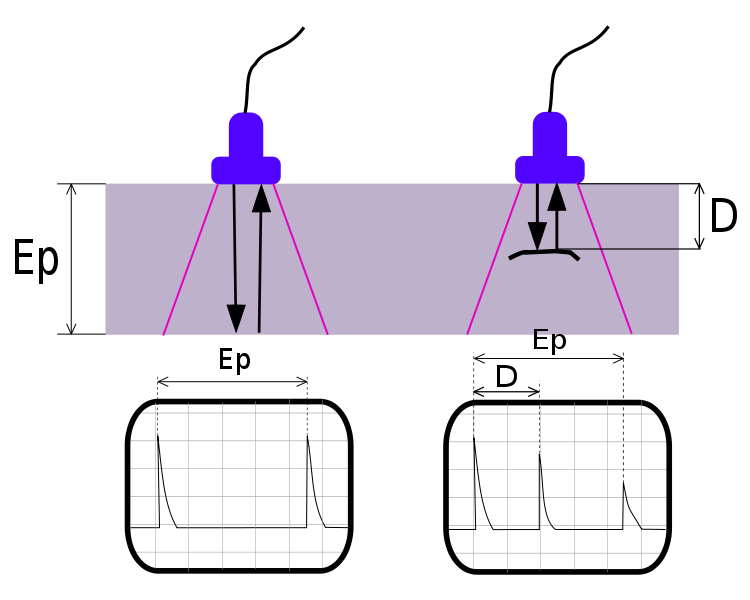
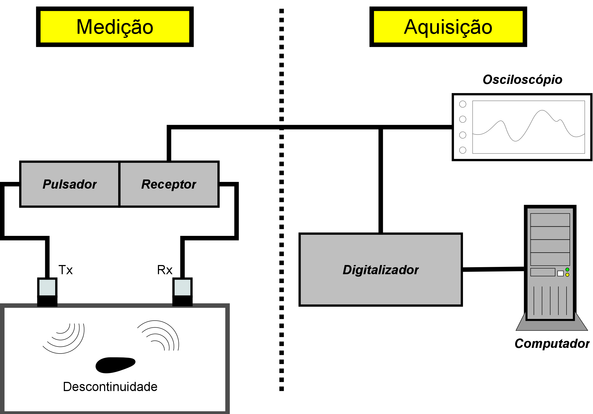
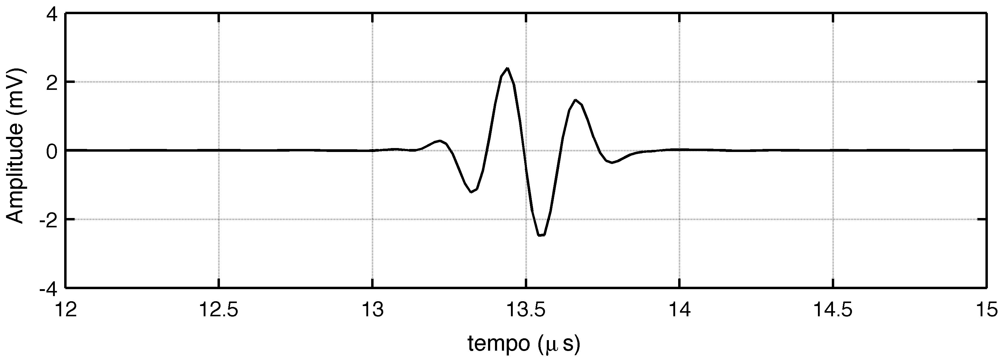
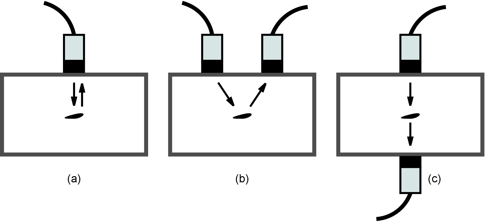
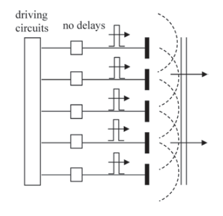
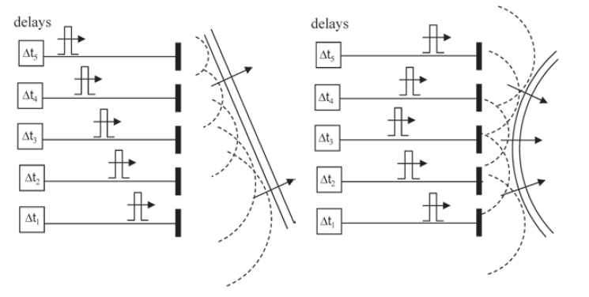
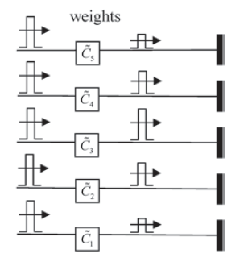
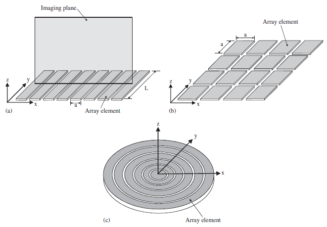

Ensaios não destrutivos por ultrassom
=====================================

Um *Ensaio Não Destrutivo* (END) é definido como um exame, teste ou avaliação realizada em qualquer tipo de objeto, sem
que haja sobre ele nenhuma forma de alteração :cite:`Hellier2003`. O objetivo do END é determinar a presença de
condições que possam ter um efeito negativo sobre a usabilidade desse objeto. Mas, para que esse objetivo seja atingido
são necessárias: (I) definição de procedimentos de medição adequados para a detecção das condições de falha;
(II) projeto e construção da instrumentação utilizada para fazer as medições e;
(III) o desenvolvimento de técnicas para análise das medidas obtidas. Isso indica que os ENDs pertencem a uma área de
estudo multidisciplinar :cite:`Thompson1985`.

Existem diversas técnicas usadas para ENDs, cada uma com vantagens e desvantagens, sendo que a escolha da técnica mais
adequada depende das condições de falha procuradas e do objeto inspecionado. As principais técnicas, citadas pela
Associação Brasileira de Ensaios Não Destrutivos (ABENDI) :cite:`Abendi2014` são:

- ensaio visual;
- radiografia, radioscopia e gamagrafia;
- líquidos penetrantes;
- ultrassom;
- correntes parasitas e
- emissão acústica.

Entre essas técnicas, o END por ultrassom é uma das mais utilizadas devido a três razões :cite:`Thompson1985`:
(I) a facilidade na geração e recepção dos sinais ultrassônicos, que simplifica o desenvolvimento dos instrumentos de
medição; (II) a característica de penetração profunda das ondas de ultrassom no interior das peças, sem que haja
atenuação excessiva e; (III) a capacidade dos sinais de retorno (ecos) carregarem informações relacionadas com as
características do material e de descontinuidades encontradas. Com base nisso, a técnica de END por ultrassom é aplicada
quando se deseja não somente encontrar descontinuidades no interior de peças, mas também classificá-las e
caracterizá-las por seus tamanhos, formas, orientação e localização.

Os instrumentos de medição utilizados no END por ultrassom emitem ondas ultrassônicas no objeto inspecionado e, em
seguida, recebem os eventuais sinais refletidos por descontinuidades internas ao objeto, conforme mostrado na
:numref:`fig_f0`. Então, esses sinais de eco são digitalizados por um sistema de aquisição e disponibilizados para
análise. Tais sinais são chamados de *sinais de varredura em amplitude* (*A-scan* -- *amplitude scanning*)
:cite:`Schmerr1998`. Inspetores treinados e qualificados são capazes de analisar tais sinais e obter as informações
necessárias para a caracterização das descontinuidades encontradas.

    Princípio de END por ultrassom.

Sistema de inspeção END por ultrassom
=====================================

A realização de um END por ultrassom necessita de um sistema de medição e aquisição apropriado.
A :numref:`fig_BlockDiagNDT` apresenta o diagrama em blocos básico de um sistema de inspeção desse tipo. Tal sistema
pode ser dividido em duas partes: sistema de medição e sistema de aquisição. O sistema de medição é responsável pela
geração e transmissão das ondas ultrassônicas que incidem na peça inspecionada, a recepção dos ecos emitidos pelas
descontinuidades encontradas na peça e a sua conversão em sinais elétricos. O sistema de aquisição tem a função de
digitalizar os sinais elétricos dos ecos recebidos e disponibilizar esses dados para computadores, onde são realizados
os processamentos necessários para a análise posterior dos sinais.

Dentro do sistema de medição, o pulsador é o elemento responsável por gerar pulsos elétricos de curta duração
(:math:`\approx` 0,1 us) e amplitude na ordem de centenas de Volts :cite:`Schmerr1998`. Esses pulsos excitam
um transdutor piezoelétrico, que emite ondas sonoras de alta frequência (ultrassom). Como o transdutor está em contato
com a peça inspecionada, essas ondas sonoras se propagam pelo material da peça.

    Diagrama de blocos de um sistema END por ultrassom.

Ao atingir alguma descontinuidade dentro da peça, as ondas sonoras incidentes interagem com a mesma. Essa interação
causa um espalhamento das ondas incidentes, de modo que elas são refletidas como ecos em diversas direções
:cite:`Baborovsky1973,Kino1979`. As ondas refletidas podem ser recebidas por um transdutor piezoelétrico receptor e
convertidas em sinais elétricos. Esses sinais elétricos, após amplificados, representam em sua amplitude a energia
instantânea dos ecos recebidos (na posição do transdutor de recepção) em função do tempo. Tais sinais recebem a
denominação de *A-scan* :cite:`Schmerr1998`. Um exemplo de sinal *A-scan* é apresentado na :numref:`fig_AscanEx`.

    Exemplo de sinal \emph{A-scan} capturado por um sistema de inspeção.

Existem três configurações diferentes para inspeção por contato utilizando ultrassom: pulso-eco, *pitch-catch* e
transparência (*through-transmission*) :cite:`Schmerr1998`. Essas configurações são mostradas na
:numref:`fig_NDTConfigs`.

    Configurações para inspeção por contato com ultrassom: (a) pulso-eco, (b) *pitch-catch* e (c) transparência.

Na configuração pulso-eco é utilizado o mesmo transdutor para emitir o pulso ultrassônico e receber a resposta refletida
de alguma descontinuidade existente na peça. Nessa configuração, o transdutor fica em contato somente com uma das
superfícies da peça inspecionada, permitindo a inspeção mesmo em peças que apresentem alguma superfície de acesso
difícil (p. ex. a superfície interna de tanques de armazenamento de óleo e derivados). Além de ser possível a detecção
de descontinuidades internas a peça, a configuração pulso-eco permite também a medição da espessura da peça, com a
detecção do eco produzido pela reflexão do pulso emitido na superfície oposta :cite:`Andreucci2011`.

Quando são utilizados dois transdutores diferentes para a emissão do pulso e a recepção do eco, mas ambos em contato com
a mesma superfície da peça, tem-se a configuração chamada *pitch-catch* ou *tandem* :cite:`Mayer1990,Spies2012vb`. Com
essa configuração é possível detectar, de forma mais apropriada, alguns tipos de descontinuidades existentes no interior
da peça, aproveitando a reflexão especular e também a difração dessas descontinuidades :cite:`Raillon2005`. 

Um sinal *A-scan* contém informações sobre a descontinuidade que gerou o sinal de eco. Com o atraso no tempo entre o
pulso elétrico emitido pelo pulsador e o pulso observado no sinal de eco, é possível determinar a distância percorrida
pelas ondas sonoras, desde o ponto de sua emissão até o ponto de sua recepção. No caso de inspeções com a configuração
pulso-eco, esse atraso é dado por :math:`{\Delta}t = 2 z / c`, em que :math:`z` é a distância da superfície inspecionada
até a descontinuidade e :math:`c` é a velocidade de propagação do som no material inspecionado. Já a amplitude do sinal
*A-scan* depende do tipo de descontinuidade e de seu tamanho :cite:`Kino1979,Doyle1978`.

Ultrassom por *phased-array*
============================

O uso de *phased-array* em END tem crescido nos últimos tempos por apresentar melhor desempenho em relação a utilização
de apenas um único transdutor. Suas principais vantagens são a capacidade de controlar eletronicamente a focalização e
direção do feixe, possibilidade de realizar diferentes inspeções de uma mesma localização. Dessa forma, isso permite uma
visualização mais rápida da estrutura interna do objeto a ser inspecionado :cite:`Drinkwater2006525`.

O transdutor *phased-array* consiste em um conjunto de pequenos elementos piezoelétricos individualmente conectados,
em que cada elemento é conduzido separadamente e a resposta de cada elemento é recebida independente. A
:numref:`fig_nodelay` mostra uma configuração em que os elementos do *array* são conectados a um circuito e todos
excitados da mesma forma.

    Configuração em que os pulsos elétricos são gerados em sequência e sem atrasos :cite:`Schmerr2015`.

Então os pulsos elétricos de condução se propagam simultaneamente, ou seja sem tempos de atraso. Portanto, cada pequeno
elemento do *array* age como um ponto de fonte e irradia uma onda esférica, as ondas formadas por cada elemento se
combinam formando um pulso de onda, como mostram as linhas pontilhadas da :numref:`fig_nodelay`. Uma outra possível
configuração para *phased-array* é mostrada na :numref:`fig_delayconf`.

    *Phased-array* configurado com atrasos de tempo, fazendo com que o feixe de som seja focalizado e direcionado :cite:`Schmerr2015`.

Essa configuração consiste em variar atrasos de tempo relativos dos pulsos elétricos que são propagados até os pequenos
elementos. O conjunto de atrasos de tempo relativo é denominado de *delay law* ou lei de atraso :cite:`Chatillon2000`.
Esses atrasos fazem com que o *phased-array* seja capaz de guiar e focalizar o feixe de som em diferente direções, sem
que seja necessário movimentar o transdutor. Os atrasos de tempo relativos também podem ser usados para modificar as
características dos sinais recebidos no *array*. A medida em que a onda atinge cada elemento do *array*, vários pulsos
são gerados e se os atrasos são aplicados aos sinais recebidos então todos os sinais ocorrem ao mesmo tempo e podem ser
somados.

Devido ao fato de que um *phased-array* pode transmitir e receber com cada elemento independentemente dos outros
elementos, é possível aplicar pesos de amplitudes, aos elementos tanto na geração e recepção de sinais. O conjunto de
pesos de amplitude é denominado *apodization law*. A :numref:`fig_weightsamplitude` mostra como esses pesos de amplitude
são aplicados aos pulsos.

    Pesos de amplitudes são aplicados aos pulsos :cite:`Schmerr2015`.

Os transdutores *phased-array* apresentam diferentes geometrias, de acordo com :cite:`Drinkwater2006525`, eles podem ser
classificados como unidimensional (1-D), bidimensional (2-D) ou anular e são ilustrados na :numref:`fig_geometria`. No
caso dos arrays 1-D, os elementos são distribuídos em um única direção (eixo :math:`x`). Enquanto que os arrays 2-D são
distribuídos em duas direções (:math:`x - y`), apresentando um padrão de grade. Os *arrays* anulares são diferentes dos
outros *arrays* em relação ao *design* e não permitem guiar o feixe.

    Geometrias típicas de um *phased-array*. a) 1-D. b) 2-D. e c) anular :cite:`Schmerr2015`.
